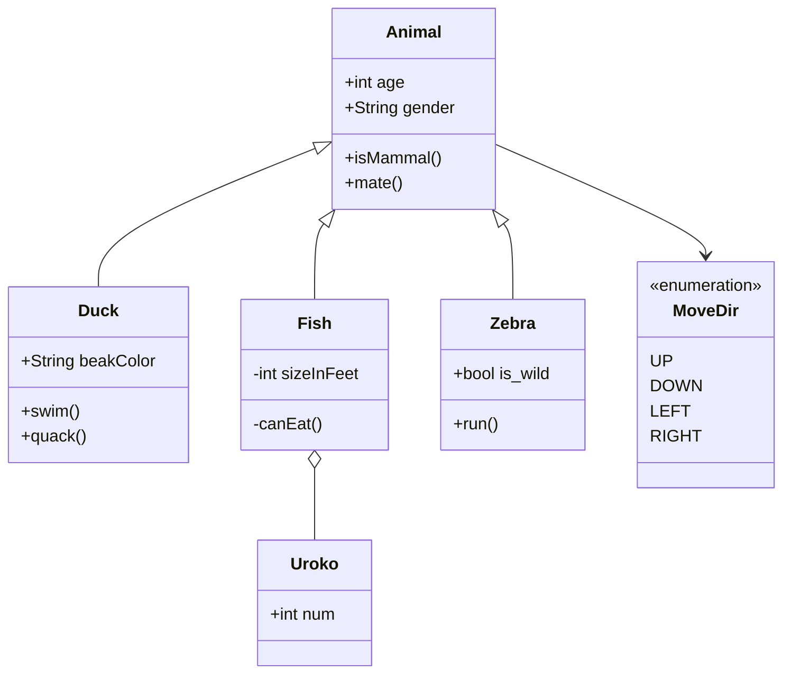
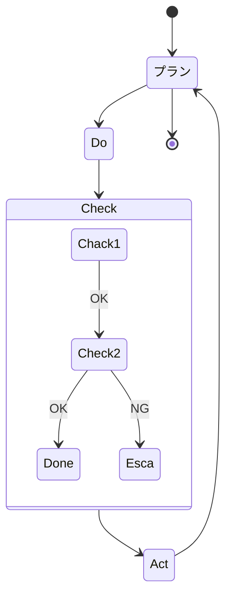
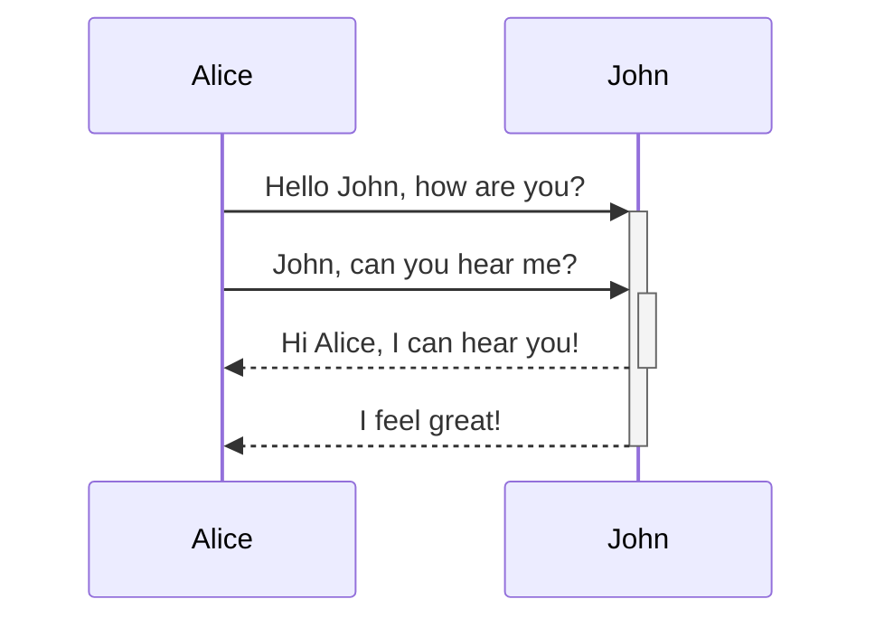

# mermaid記法(マーメイド記法)
* インストールするEXTENSION : Markdown Preview Mermaid Support  
* プレビュー方法 : 「Ctrl + Shuft + V 」or VSCode右上の本に虫眼鏡のマークを押す(プレビュー画面が開く)
* 参考 : [Abut Mermaid](https://mermaid-js.github.io/mermaid/#/)  
mermaidのサイト。記載サンプルがある。
* 参考 : [使ってみよう！VSCode+mermaid](https://www.agent-grow.com/self20percent/2020/03/05/%E4%BD%BF%E3%81%A3%E3%81%A6%E3%81%BF%E3%82%88%E3%81%86%EF%BC%81vscodemermaid/)  
便利なPluginが何個か載ってる


# 余談：マークダウン(記法)とは
* ファイルの記載ルールのひとつ  
* 変換プログラムでHTML形式にできる  
* マークダウンで記載したファイルの拡張子は".md"  
* 記法メモ
  * 改行は半角スペース2個  
  * `は「Shiht + @」で打てる  
  * \```で囲んだ部分はソースコードブロック
  * \```に続けて言語を指定するキーワード(mermaid/c/javaなど)を書く
* 参考：[Qiita マークダウン記法 一覧表・チートシート](https://qiita.com/kamorits/items/6f342da395ad57468ae3 )   


# サンプル図
## クラス図 
[Class diagrams](https://mermaid-js.github.io/mermaid/#/./classDiagram)


## フローチャート図
[Flowcharts](https://mermaid-js.github.io/mermaid/#/./flowchart?id=flowcharts-basic-syntax)
```mermaid
flowchart TD
%% graph でも良いっぽいTDはTopDown
%% 他はLR(LeftRight)、DT、RLがある
    sta[Start] --> a1
    subgraph first step
    a1 --> a2
    end

    a2 --Initialied--> C{Is it?} %% 境界部分は外に出さなきゃダメ？imai
    C --> |Yes| b1
    C --> |No| stp %% --No-->でも良い

    subgraph second step
    b1-->b2
    end
    b2-->stp[End]

```

---
以降はmermaidのサイトのサンプル張っただけ  
今回は使わないかも

## 状態遷移図



## シーケンス図
[Sequence diagrams](https://mermaid-js.github.io/mermaid/#/./sequenceDiagram)  


## その他
* Entity Relationship Diagrams(ER図)
* 円グラフ
* ガントチャート
* User Journey Diagram
などもmermaidで記載できるらしい。